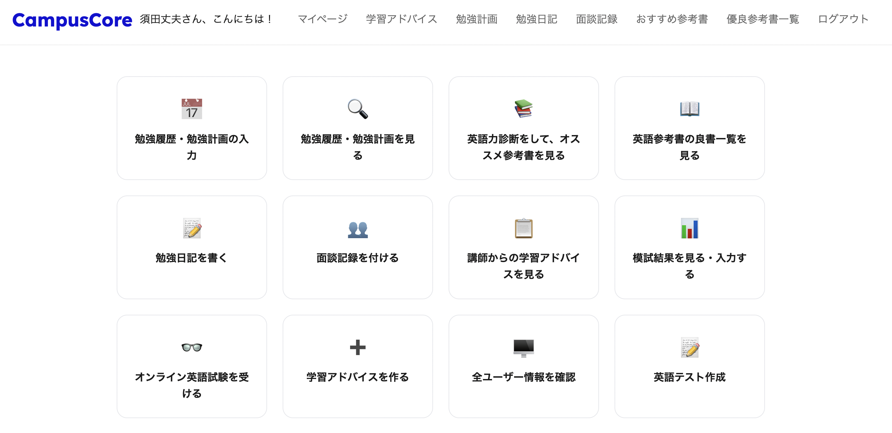
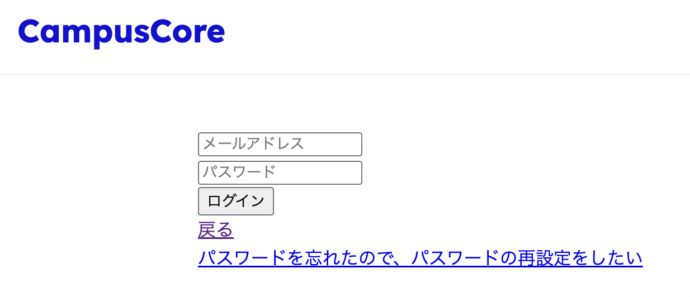

# CampusCore

`CampusCore` は、『塾・予備校における生徒情報管理システム』です。
生徒がCampusCoreにサインアップを行い個人アカウントを作成し、個人アカウント内で志望校や模試結果、日々の学習記録や学習計画を記録することにより
管理者は生徒の学習状況を正確に把握し、生徒の状況にあった的確なアドバイスを伝えることができます。

CampusCoreを活用することにより、以前は、紙媒体での生徒アンケートの管理や、生徒アンケート内容のエクセルへの打ち込み、また、生徒一人一人からの学習状況の対面
での聞き取りに要した月間合計10時間程度の業務から、講師が開放されるようになりました。

---

## CampusCoreの機能一覧

**1 ユーザー認証システム**：セキュアなサインアップ、ログイン、およびセッション管理。
**2 マイページ**
**3 管理者ページ**
**4 アンケート入力、保存機能**
**5 自由英作文添削機能（AI添削+人間の講師による添削のダブルフィードバック）**
**6 英文和訳添削機能（AI添削+人間の講師による添削のダブルフィードバック）**
**7 面談記録機能**
**8 勉強日記機能**：利用者（生徒）による勉強日記の入力作成。
**9 勉強計画記録機能**：利用者（生徒）による勉強計画の入力作成。
**10 ユーザーへの学習アドバイス送信機能**
**11 模試結果入力、保存機能**
**12 英文法テスト機能**
**13 英文法テスト結果保存機能**
**14 パスナビからの志望校情報スクレイピング機能**

---

## 技術スタック

### バックエンド / データベース
  **言語**: Ruby
  **フレームワーク**: Sinatra
  **データベース**: PostgreSQL

### フロントエンド
  **言語**: HTML5, CSS3, JavaScript

### インフラ / 開発ツール
  **ホスティング**: Render
  **データベース管理**: DBeaver
  **エディタ**: VS Code (GitHub 連携)

---

# 🎓 CampusCore

**CampusCore** is a student information management system designed for cram schools and preparatory schools.

Students can sign up and create personal accounts to record their target schools, mock exam results, daily study logs, and study plans.
This enables instructors to accurately track student progress and provide personalized, data-driven guidance.

🚀 By using CampusCore, instructors can reduce approximately **10 hours of monthly administrative work**, previously spent on paper-based surveys, spreadsheet entry, and in-person interviews.

---

## ✨ Key Features

* 🔐 **User Authentication System**
  Secure sign-up, login, and session management.

* 🎯 **Student Information Management**
  Input and manage target schools and mock exam scores.

* 📚 **Study Tracking System**
  Record daily study activities and create study plans.

---

## 🛠 Tech Stack

### Backend / Database

* **Language**: Ruby
* **Framework**: Sinatra
* **Database**: PostgreSQL

### Frontend

* **Languages**: HTML5, CSS3, JavaScript

### Infrastructure / Tools

* **Hosting**: Render
* **Database Tool**: DBeaver
* **Editor**: VS Code (GitHub integration)

---

## 💡 Highlights

* Reduced manual workload by **~10 hours/month**
* Simple and intuitive UI for students
* Clean and maintainable Ruby (Sinatra) architecture

---

## 🔮 Future Improvements

* 📈 Data visualization (graphs for progress tracking)

---
